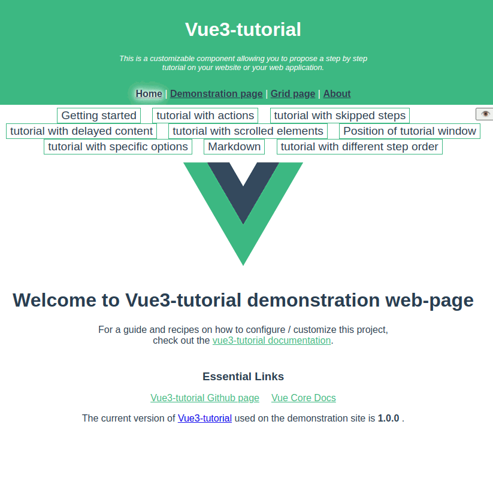

# Vue3-tutorial

> VueJS 3.X + Typescript + JSX + interactive tutorial

[](https://www.npmjs.com/package/vue3-tutorial)

## Introduction

A customizable component allowing you to propose a step by step tutorial on
your website or your web application.
User interacts directly with your interface and can be guided through your
most complex features.

It integrates well with VueJS and is reactive to option changes.

A tutorial scenario can integrate some optional steps, to adapt perfectly
with the current state and to provide a smooth experience.

Follow this link to have a
[Live demonstration](https://restimel.github.io/vue3-tutorial-demonstration/dist/index.html)!



## Example

```html
<vue3-tutorial
    :tutorial="{
      name: 'short example',
      steps: [{
        target: '.menu',
        content: 'To get help, open the menu',
        nextStep: 'click',
      }, {
        target: '.menu .help',
        content: 'You will find all help under the menu section.'
      }],
    }"
    open
/>
```
The start of the tutorial is controlled by the `open` attribute.

## Features

* Interactive with your application (it is not only a "next" "next" "finish" guide)
* May adapt the content depending on context
* CSS styles can be easily changed to fit your theme.
* Strong typing: all Typescript types are provided.

## Documentation

[Read the documentation](./docs/main.md) to know how to configure Vue3-tutorial and all its possibilities.

[List of upgrade changes](./docs/upgradeChanges.md).

## Installation

You can install vue3-tutorial from npm.

```shell
$ npm install vue3-tutorial
```

or by downloading the minified build on GitHub.
