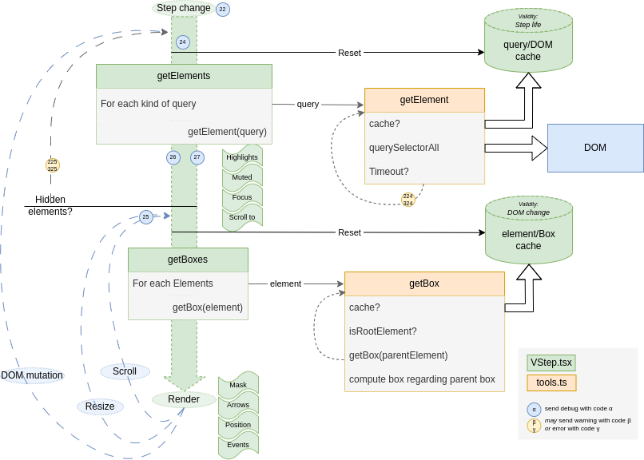

# Code Documentation: Box updates

[Back to main page](./main.md)

:wrench: Code Documentation: This page is a technical reference for developers working on the project. It is not a configuration guide.

* When Step change (or targets change in the current step)
* getTargetElements is called to retrieve all elements in current page.
* when target elements are found, it computes their bounding boxes. 
_cache is applied to avoid recomputing some elements. This often appears with several elements (they probably have the same parents)._
* If one of these elements is considered as hidden (it recomputes until the timeout is reached).
* If any change appears (element scrolls or resizes), the boxes are re-computed.
