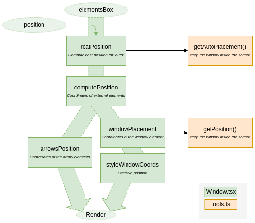

# Code Documentation: Window position

[Back to main page](./main.md)

:wrench: Code Documentation: This page is a technical reference for developers working on the project. It is not a configuration guide.

When props `elementsBox` is changed (meaning there are changes in the DOM),
`realPosition` is re-evaluated.
`realPosition` re-evaluate the position if the value is `auto` (`position`
should be changed only when step is changed).

First, `computePosition` is evaluated to find the best anchor coordinates
related to the target element.

From this value, arrow coordinates and window coordinates are evaluated.

The window should always be visible inside the screen.

## Position choice

When `position` option is `'auto'`.

The position will depend on the available space around the target.

**case 1**: the window is smaller than the target

**case 2**: the window is greater than the target and there is enough space
around

**case 3 & 4**: the window is greater than the target but there is not enough
space to display the window at the left/right/top/bottom.

**case 5**: There is not enough space around the target.

First we check the _case 1_ is any position fit. Then we check next _case_
until _case 5_.

For each case, the position order is check with `bottom`, `top`, `right` and
finally `left`.
